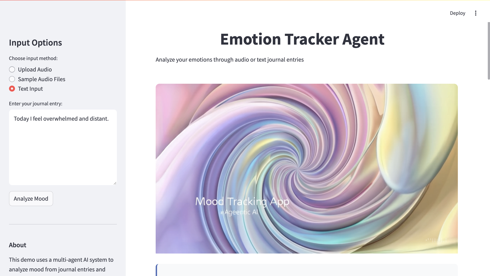
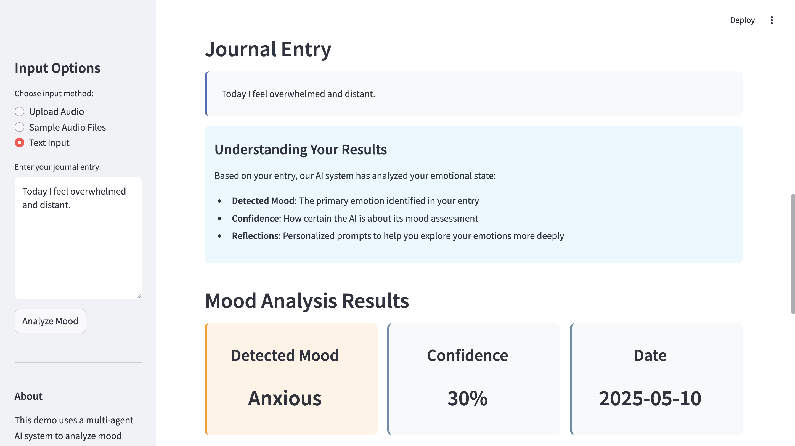

# Emotion Tracker Agent



An intelligent multi-agent AI system that analyzes emotions from journal entries or audio recordings, and provides personalized reflections to help users understand their emotional well-being.

## [Watch Demo Video]( https://drive.google.com/file/d/1LoFhXcSpVqzKzgP6D1nPuLXXDEHGQ1Ni/view)

## Overview

Emotion Tracker Agent uses a crew of specialized AI agents to detect and analyze emotional states. The system can process both text-based journal entries and audio recordings, making it flexible for different user preferences. After analysis, it provides personalized reflections designed to promote emotional awareness and self-understanding.

## Features

- **Multi-input Support**: Process journal entries via text or audio recordings
- **Emotion Detection**: Advanced AI analysis to detect emotional states
- **Confidence Scoring**: Indicates the AI's certainty about its emotional assessment
- **Personalized Reflections**: AI-generated prompts to explore emotions more deeply
- **Structured Journaling**: Saves entries in a structured JSON format for tracking over time
- **User-friendly Interface**: Streamlit-based UI with intuitive controls and visualization

## Architecture

The application uses a multi-agent system built with CrewAI:

1. **Mood Detector Agent**: Analyzes input to identify emotional states
2. **Reflection Coach Agent**: Generates personalized questions based on detected emotions
3. **Journal Logger Agent**: Formats the analysis and reflections into structured data

## Tech Stack

- **CrewAI**: For orchestrating the multi-agent workflow
- **Whisper**: For audio transcription
- **Gemini**: AI foundation model powering the agents
- **Streamlit**: For the user interface
- **Python**: Core application language

## Installation

1. Clone the repository:
   ```bash
   git clone https://github.com/yourusername/emotion-tracker-agent.git
   cd emotion-tracker-agent

2. Install dependencies:
bashpip install -r requirements.txt

3. Set up your environment variables in a .env file:
GEMINI_API_KEY=your_gemini_api_key
MODEL=gemini-1.5-flash

Choose your input method:

Upload Audio: Upload a WAV file recording
Sample Audio Files: Use provided sample audio recordings
Text Input: Enter a text-based journal entry


Click "Analyze Mood" to process your input
View your results:

Detected mood with confidence level
Date of the entry
Personalized reflections to explore your emotions


## Example Workflow

User uploads an audio recording about feeling anxious about a presentation
Whisper transcribes the audio to text
Mood Detector Agent analyzes the text and detects anxiety
Reflection Coach Agent generates questions to explore the anxiety
Journal Logger Agent formats everything into a structured entry
UI displays the mood analysis and expandable reflection sections




## Acknowledgements

- CrewAI
- Whisper
- Streamlit
- Gemini API

